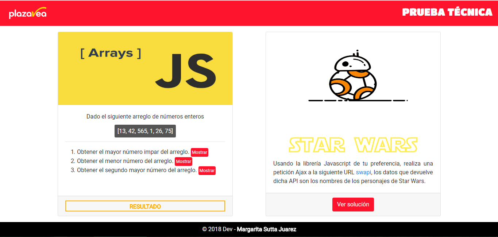
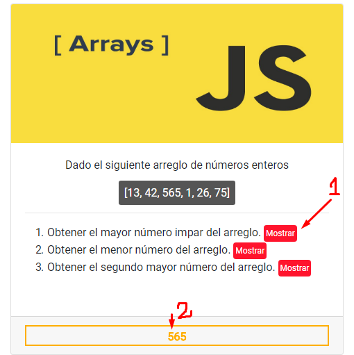
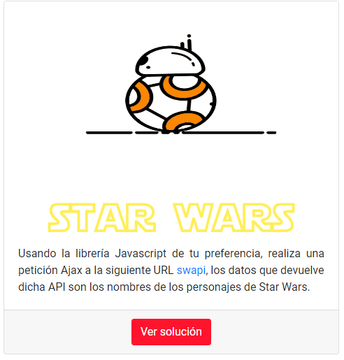

# Prueba técnica - PLAZA VEA

* **Desarrolladora:** _Margarita Sutta._

***

La prueba consiste en 2 ejercicio a resolver:

 

 1. El primero obtener hallar valores de acuerdo a lo requerido, el resultado se vera cada vez que de clic en mostrar.

  

2. Consulta al API SWAPI para mostrar los datos de los personajes de Star Wars.

  
  


***

## Desarrollo de la aplicación

1. The Star Wars API :

> [SWAPI](https://swapi.co/)

```

```javascript
  const url = `https://swapi.co/api/people/${i}/`;
```

***

## Herramientas a utilizar

1. HTML 5
2. CSS3
3. Bootstrap 4
4. Javascript
5. jQuery
6. SWapi

***
